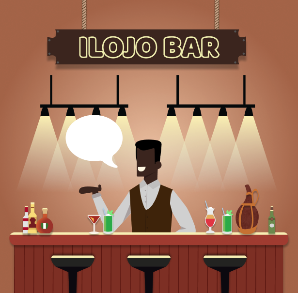
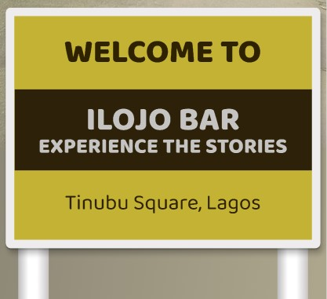

# Ilojo Bar Virtual Monument

 

## Table of contents 🔢
  * [Description](#description-👩🏻‍💻)
  * [The Client](#the-client-🤝🏻)
  * [How does it work](#how-does-it-work-❔)
  * [Design challenge](#design-challenge-🖌)
  * [Moscow](#moscow)
  * [Licence](#licence-⚠)

## Description 👩🏻‍💻
Ilojo Bar or Casa do Fernandez was an iconic national monument in Lagos, Nigeria, which was illegally demolished in 2016. Because it got demolished Lagos lost a special building. This web app gives the people of Lagos the opportunity to virtually "visit" the monument and read its stories. 

## The Client 🤝🏻

Legacy has been formed with the object of gathering together committed men and women, Nigerians and non-Nigerians, united for the common cause of promoting and reserving the character and appearance of historic monuments and the environment and cultural entities in all parts of Nigeria. The aim of Legacy is to identify historical buildings, monuments and areas of the built environment which would be singled out for their contribution to the evolution, history and culture of Nigeria. 
We were given this project by Femke van Zeijl, who works at the Historical and Environmental Group of Nigeria, Lagacy. She wrote her thesis on the Ilojo Bar which is one of the historical buidlings in Lagos, and she wanted to bring it back to life.

 

## How does it work ❔

Once you have opened the website, you are shown the beautiful Ilojo Building together with the environment. The sign welcomes you and it really feels as if you are there. Once you have clicked on the Ilojo Bar Building, you are being shown the inside of the building, the bar. While you are at the bar, the best person to tell you stories is ofcourse the barman. Take a look at the menu and let the barman indulge you in it's wonderful stories about the Ilojo Bar. 

 

## Design challenge 🖌
Design and develop an interactive virtual monument for Ilojo Bar.
Attractive and functional for residents of a country with low bandwidth, where many only use the internet via their mobile phone, while it is also beautiful for desktop.

## Moscow 🧔🏻

[link to our Project Board](https://github.com/users/ppijn/projects/1/views/1)

### Must have

* 3d Model ✅
* Bar man that tells you the stories ✅
* Api for the Ilojo Bar ✅
* The stories visually designed ✅

### Should Have

* Fallback versions of the website ✅
* Scaled down images so the website is faster ✅

### Could Have

* Adding your own stories of the ilojo bar
* Zoom in animation transition to the next page
* More responsiveness and Desktop version

### Want to have

* AR function to see the building in RealLife scale
* More functionalities and nice extras

## Licence ⚠

This work is licensed under [GNU GPLv3](./LICENSE).
