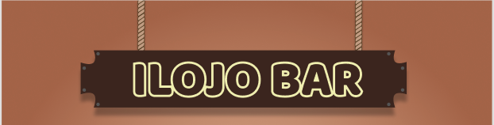

# Ilojo Bar Virtual Monument

## Table of contents
  * [Description](#description)
  * [The client](#the-client)
  * [Design challenge](#design-challege)
  * [Licentie](#licentie)

## Description
Ilojo Bar or Casa do Fernandez was an iconic national monument in Lagos, Nigeria, which was illegally demolished in 2016. Because it got demolished Lagos lost a special building. This web app gives the people of Lagos the opportunity to virtually "visit" the monument and read its stories. 

## The client
Legacy | The Historical and Environmental Group of Nigeria, in de persoon van Femke van Zeijl, hoofd onderzoek.

## Design challenge
Design and develop an interactive virtual monument for Ilojo Bar.
Attractive and functional for residents of a country with low bandwidth, where many only use the internet via their mobile phone, while it is also beautiful for desktop.

## Licentie

This work is licensed under [GNU GPLv3](./LICENSE).
